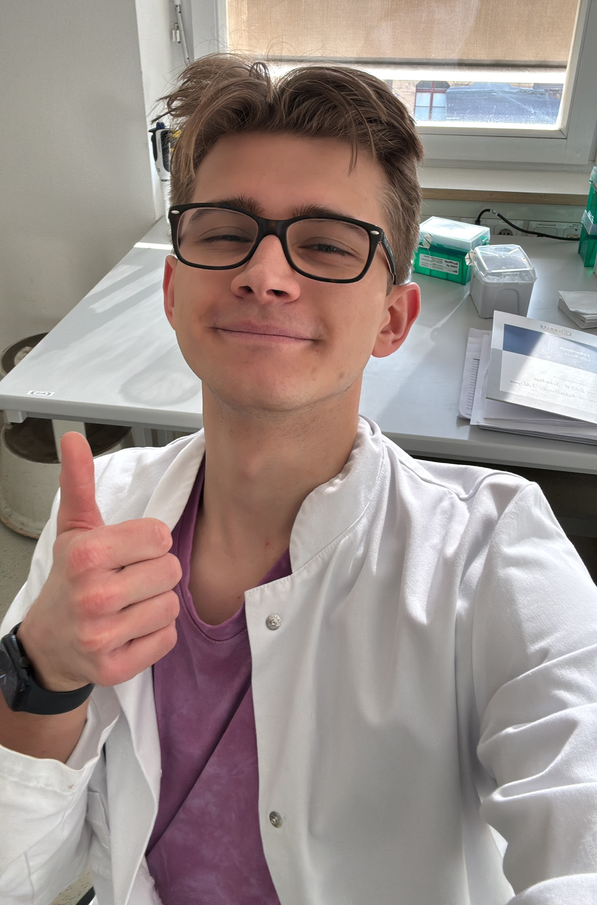

<a href="krimskrams\" class="krimskrams-link">Button!</a>

::: {.profile-grid}

::: {.profile-photo}

:::

::: {.profile-text}

# Sebastian Baer

Hey! I am a fourth year medical student and particularly interested in cardiovascular medicine and cardiometabolic disease.

Currently doing my MD thesis (Dr. med.) in the labs for invasive hemodynamics (AG Alogna) and Translational Approaches in Heart Failure and Cardiometabolic Disease (AG Schiattarella).

Email: sebastian (dot) baer (at) charite (dot) de
:::

:::